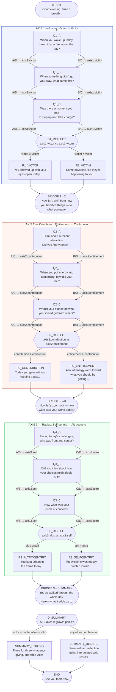

```mermaid
flowchart TD

    START(["START\nGood evening. Take a breath..."])
    START --> Q1_A

    subgraph AXIS1["AXIS 1 — Locus: Victim ↔ Victor"]
        Q1_A["Q1_A\nWhen you woke up today,\nhow did you feel about the day?"]
        Q1_A -->|"A/D → axis1:victor"| Q1_B
        Q1_A -->|"B/C → axis1:victim"| Q1_B

        Q1_B["Q1_B\nWhen something didn't go\nyour way, what came first?"]
        Q1_B -->|"A/D → axis1:victor"| Q1_C
        Q1_B -->|"B/C → axis1:victim"| Q1_C

        Q1_C["Q1_C\nWas there a moment you had\nto step up and take charge?"]
        Q1_C -->|"A/D → axis1:victor"| D1_REFLECT
        Q1_C -->|"B/C → axis1:victim"| D1_REFLECT

        D1_REFLECT{{"D1_REFLECT\naxis1.victor vs axis1.victim"}}
        D1_REFLECT -->|"victor ≥ victim"| R1_VICTOR
        D1_REFLECT -->|"victim > victor"| R1_VICTIM

        R1_VICTOR["R1_VICTOR\nYou showed up with your\neyes open today..."]
        R1_VICTIM["R1_VICTIM\nSome days feel like they're\nhappening to you..."]
    end

    R1_VICTOR --> BRIDGE_1_2
    R1_VICTIM --> BRIDGE_1_2

    BRIDGE_1_2(["BRIDGE 1→2\nNow let's shift from how\nyou handled things — to what you gave."])
    BRIDGE_1_2 --> Q2_A

    subgraph AXIS2["AXIS 2 — Orientation: Entitlement ↔ Contribution"]
        Q2_A["Q2_A\nThink about a recent interaction.\nDid you find yourself…"]
        Q2_A -->|"A/C → axis2:contribution"| Q2_B
        Q2_A -->|"B/D → axis2:entitlement"| Q2_B

        Q2_B["Q2_B\nWhen you put energy into\nsomething, how did you feel?"]
        Q2_B -->|"A/C → axis2:contribution"| Q2_C
        Q2_B -->|"B/D → axis2:entitlement"| Q2_C

        Q2_C["Q2_C\nWhat's your stance on what\nyou should get from others?"]
        Q2_C -->|"A/C → axis2:contribution"| D2_REFLECT
        Q2_C -->|"B/D → axis2:entitlement"| D2_REFLECT

        D2_REFLECT{{"D2_REFLECT\naxis2.contribution vs axis2.entitlement"}}
        D2_REFLECT -->|"contribution ≥ entitlement"| R2_CONTRIBUTION
        D2_REFLECT -->|"entitlement > contribution"| R2_ENTITLEMENT

        R2_CONTRIBUTION["R2_CONTRIBUTION\nToday you gave without\nkeeping a tally..."]
        R2_ENTITLEMENT["R2_ENTITLEMENT\nA lot of energy went toward\nwhat you should be getting..."]
    end

    R2_CONTRIBUTION --> BRIDGE_2_3
    R2_ENTITLEMENT --> BRIDGE_2_3

    BRIDGE_2_3(["BRIDGE 2→3\nNow let's zoom out — how\nwide was your world today?"])
    BRIDGE_2_3 --> Q3_A

    subgraph AXIS3["AXIS 3 — Radius: Self-centric ↔ Altrocentric"]
        Q3_A["Q3_A\nFacing today's challenges,\nwho was front and center?"]
        Q3_A -->|"A/B → axis3:self"| Q3_B
        Q3_A -->|"C/D → axis3:altro"| Q3_B

        Q3_B["Q3_B\nDid you think about how\nyour choices might ripple out?"]
        Q3_B -->|"A/B → axis3:self"| Q3_C
        Q3_B -->|"C/D → axis3:altro"| Q3_C

        Q3_C["Q3_C\nHow wide was your\ncircle of concern?"]
        Q3_C -->|"A/B → axis3:self"| D3_REFLECT
        Q3_C -->|"C/D → axis3:altro"| D3_REFLECT

        D3_REFLECT{{"D3_REFLECT\naxis3.altro vs axis3.self"}}
        D3_REFLECT -->|"altro ≥ self"| R3_ALTROCENTRIC
        D3_REFLECT -->|"self > altro"| R3_SELFCENTRIC

        R3_ALTROCENTRIC["R3_ALTROCENTRIC\nYou kept others in\nthe frame today..."]
        R3_SELFCENTRIC["R3_SELFCENTRIC\nToday's lens was mostly\npointed inward..."]
    end

    R3_ALTROCENTRIC --> BRIDGE_3_SUMMARY
    R3_SELFCENTRIC --> BRIDGE_3_SUMMARY

    BRIDGE_3_SUMMARY(["BRIDGE 3→SUMMARY\nYou've walked through the whole day.\nHere's what it adds up to."])
    BRIDGE_3_SUMMARY --> D_SUMMARY

    D_SUMMARY{{"D_SUMMARY\nAll 3 axes = growth poles?"}}
    D_SUMMARY -->|"victor + contribution + altro"| SUMMARY_STRONG
    D_SUMMARY -->|"any other combination"| SUMMARY_DEFAULT

    SUMMARY_STRONG["SUMMARY_STRONG\nThree for three — agency,\ngiving, and wide view."]
    SUMMARY_DEFAULT["SUMMARY_DEFAULT\nPersonalized reflection\nusing interpolated axis results."]

    SUMMARY_STRONG --> END
    SUMMARY_DEFAULT --> END

    END(["END\nSee you tomorrow."])

    style AXIS1 fill:#f0f4ff,stroke:#6b7fcc,stroke-width:1.5px
    style AXIS2 fill:#fff4f0,stroke:#cc7b6b,stroke-width:1.5px
    style AXIS3 fill:#f0fff4,stroke:#6bcc8a,stroke-width:1.5px
```
